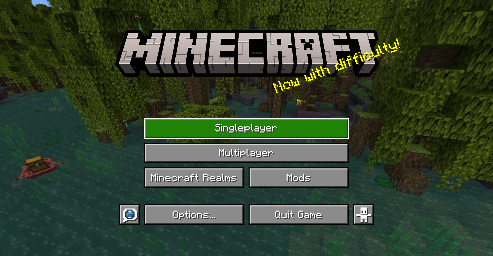

> A gui style for menus based on Bedrock Edition

## About

This pack changes the style of most menu buttons (even some modded ones!) to look more like Bedrock Edition's gui. It also replaces the vanilla title with the Bedrock one.

Supported mods:

- [Mod Menu](https://modrinth.com/mod/modmenu)
- [Capes](https://modrinth.com/mod/capes)
- [Malilib](https://www.curseforge.com/minecraft/mc-mods/malilib)
- [Litematica](https://www.curseforge.com/minecraft/mc-mods/litematica)

This pack also supports [Respackops!](https://modrinth.com/mod/respackopts) If you have it installed, you'll be able to disable certain features or even try out alternate styles!

## Install

#### Find your resourcepacks folder

The quickest and easiest way to do this is from in-game.

1. Open up your desired version of Minecraft.
2. Go into "Options" and then "Resource Packs"
3. Click "Open Pack Folder"

#### Download the pack

The easiest way to do this is to clone the repo, if you have Git installed. Open a terminal or commandline in your resourcepacks folder and clone:

    git clone https://github.com/Xetheon/bedrock-gui "Bedrock GUI"

This will also keep the pack up do date automatically. Alternatively, you can download the pack manually by going to any of its release pages.

- [Github Releases](https://github.com/Xetheon/bedrock-gui/releases)
- [Modrinth](https://modrinth.com/resourcepack/bedrock-gui)
- [CurseForge](https://www.curseforge.com/minecraft/texture-packs/bedrock-gui)

##### If you have any troubles installing, check out the Minecraft Wiki page on [how to install resourcepacks](https://minecraft.fandom.com/wiki/Tutorials/Loading_a_resource_pack).

## Resources

- Want to use these assets in your own works? See the [license](https://github.com/Xetheon/bedrock-gui/blob/main/LICENSE.md)
- Curious about updates on things I work on or just want to hang out? Join my [Discord!](https://discord.gg/3gtNAQgv2G)
- Interested in other packs I've made? Check out [this list!](https://gist.github.com/Xetheon/c3d677e0762658f8d79cf05e2c6e65ff)
